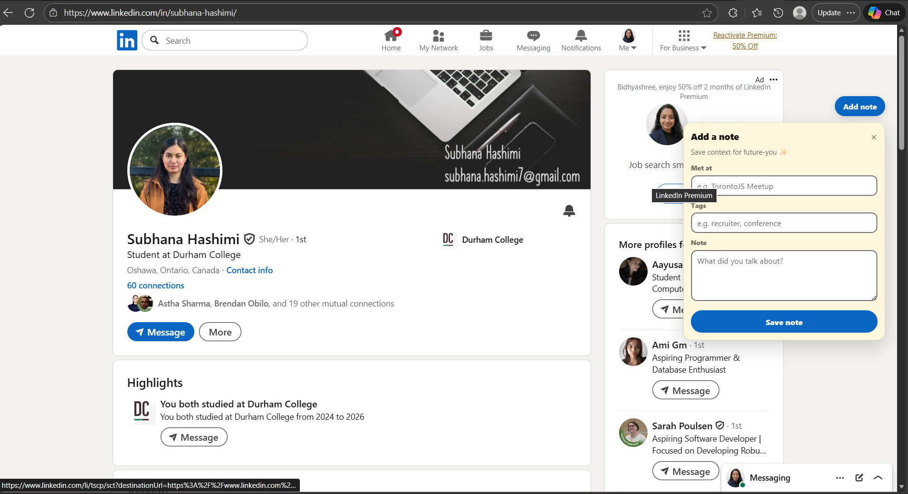
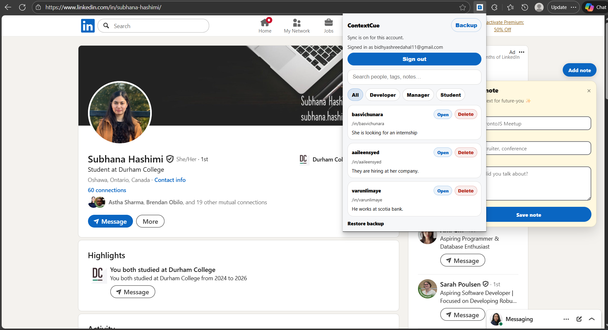
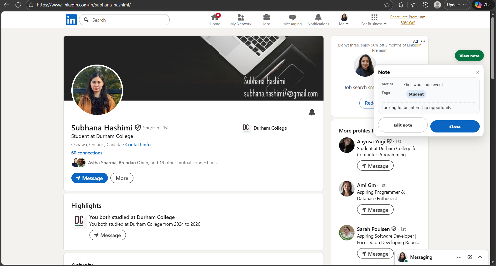

# ContextCue — LinkedIn Context Notes

ContextCue helps you save and recall private notes about LinkedIn profiles.
Add a quick note on a profile, then manage all notes from the extension popup.

## What it does

- Save notes per LinkedIn profile
- View notes later on the same profile
- Search and filter notes in the popup
- Open a profile directly from the notes list
- Backup/restore notes
- Optional sync across devices via Supabase login

## Who it is for

- Recruiters and sourcers
- Founders doing outreach
- Networkers who meet many people

## How it works

- **On LinkedIn:** you see an “Add note / View note” pill on profile pages.
- **In the extension popup:** you can search, filter, export, and import notes.

## Local vs Sync

By default, notes are stored locally in your browser.
If you sign in, notes sync to Supabase so they follow you across devices.

## Why it is different

Most tools with LinkedIn notes are full sales/CRM platforms.
ContextCue stays lightweight and personal — just notes, fast and private.

## Tech stack

- Chrome Extension (Manifest V3)
- React + TypeScript
- Vite build
- Supabase Auth + Postgres (optional sync)
- `chrome.storage.local` for local notes

## Screenshots

### Add a note on a profile


### Manage notes in the popup


### View a saved note


## Dev setup

### 1) Install dependencies
```
npm install
```

### 2) Create `.env`
```
VITE_SUPABASE_URL=your_project_url
VITE_SUPABASE_ANON_KEY=your_anon_key
```

### 3) Build the extension
```
npm run build
```

### 4) Load in Edge/Chrome
- Go to `chrome://extensions` (or `edge://extensions`)
- Enable Developer Mode
- Load unpacked → select the `dist` folder

### 5) Icon set
Icons live in `public/icons` and are copied into `dist/icons` on build.
Replace those files if you want a different icon.

## Notes

- This extension only works in desktop browsers.
- No notes leave your device unless you sign in to sync.
